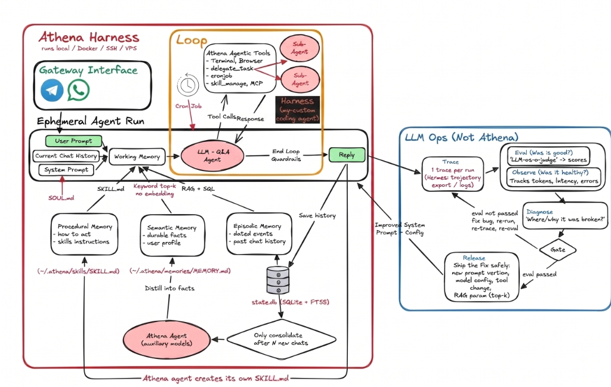

# 🏛️ Athena: Autonomous Multi-Tool AI Agent System

[](https://www.typescriptlang.org/)
[](https://www.sqlite.org/)
[](https://playwright.dev/)
[](https://modelcontextprotocol.io/)
[](https://langfuse.com/)

**Athena** is a state-of-the-art, autonomous, multi-agent AI assistant framework built in TypeScript. Athena is a **local-first AI agent** with direct access to your local machine (terminal, filesystem, browser, Python execution), persistent SQLite episodic memory, dynamic procedural skill learning ("grows with you"), recursive sub-agent delegation, headless browser automation via Playwright, background cron scheduling, and end-to-end telemetry through Langfuse and OpenTelemetry.

---

## 📹 Demo

> 🎬 **Watch Athena in Action**:

<video src="https://github.com/user-attachments/assets/a110cbc1-b913-4703-a54e-3c84bafeb9ab" controls width="100%"></video>

[🎥 Watch Demo Video](https://github.com/user-attachments/assets/a110cbc1-b913-4703-a54e-3c84bafeb9ab)

---

## 📋 Table of Contents

- [📹 Demo](#-demo)
- [💡 Core Philosophy](#-core-philosophy)
- [✨ Key Features & Capabilities](#-key-features--capabilities)
- [🏗️ System Architecture & Structure](#️-system-architecture--structure)
  - [📐 System Architecture Diagram](#-system-architecture-diagram)
  - [📂 Directory & File Structure](#-directory--file-structure)
- [⚡ Quick Start & Getting Started](#-quick-start--getting-started)
  - [Prerequisites](#prerequisites)
  - [1. Clone & Install Dependencies](#1-clone--install-dependencies)
  - [2. Configure Environment Variables](#2-configure-environment-variables)
  - [3. Build the Project](#3-build-the-project)
- [🧠 Multi-LLM Provider Architecture](#-multi-llm-provider-architecture)
  - [Supported Providers](#supported-providers)
  - [Runtime Provider Switching](#runtime-provider-switching)
- [🔌 Model Context Protocol (MCP) Setup & Configuration](#-model-context-protocol-mcp-setup--configuration)
  - [1. Configuration File (`mcp_servers.json`)](#1-configuration-file-mcp_serversjson)
  - [2. Supported Transport Modes](#2-supported-transport-modes)
  - [3. Server Configuration Options](#3-server-configuration-options)
  - [4. How MCP Integration Works Under the Hood](#4-how-mcp-integration-works-under-the-hood)
- [💻 Usage & CLI Commands](#-usage--cli-commands)
  - [Start the CLI Client](#start-the-cli-client)
  - [Autonomous Unattended Execution (`--allow-all`)](#autonomous-unattended-execution---allow-all)
  - [In-CLI Commands](#in-cli-commands)
  - [Start the Telegram Gateway](#start-the-telegram-gateway)
- [🧪 Manual Feature Test Prompts](#-manual-feature-test-prompts)
  - [Flagship prompts](#flagship-prompts)
  - [Other prompts](#other-prompts)
- [📊 Evaluation & Benchmark Suite](#-evaluation--benchmark-suite)
  - [Running the Benchmarks](#running-the-benchmarks)
  - [Trajectory Assertions & Side-Effect Checks](#trajectory-assertions--side-effect-checks)
  - [Regression Gate & CI/CD](#regression-gate--cicd)
- [🧪 Test Suite & Verification](#-test-suite--verification)
- [🛠️ Advanced Concepts](#️-advanced-concepts)
  - [1. Sub-Agent Depth & Safety Caps](#1-sub-agent-depth--safety-caps)
  - [2. Memory Architecture](#2-memory-architecture)
- [📜 License](#-license)

---

## 💡 Core Philosophy

### 💻 1. Local Machine Access & Native Integration
Athena operates directly on your local system, giving it hands-on execution capabilities:
* **Local Terminal Execution**: Runs shell commands, scripts, git workflows, and system commands via the `terminal` tool.
* **Direct Filesystem Management**: Inspects, reads, writes, and refactors workspace directories and files locally via `filesystem`, `readFile`, and `delegateCodingTask`.
* **Local Python Sandbox**: Runs Python code locally for data processing, calculations, and automation (`executePython`).
* **Local Browser Automation**: Controls a local headless Chromium browser using Playwright to inspect websites, extract dynamic DOM elements, and capture screenshots (`browser`, `interactiveBrowser`).

### 🌱 2. Self-Evolving Intelligence ("Grows With You")
Athena isn't stateless—it learns your environment, adapts to your workflows, and gets smarter over time:
* **Procedural Skill Learning (`skills/`)**: When Athena discovers a new workflow or solution, it creates and stores reusable skill guides using `skillManage`. Future runs automatically load and build upon these learned skills.
* **Episodic & Long-Term Memory**: All interactions, past decisions, tool results, and session contexts are stored persistently in SQLite (`state.db`).
* **Continuous Memory Consolidation**: A background LLM consolidation pipeline periodically analyzes past sessions to extract long-term user preferences, project insights, and coding style, allowing Athena to grow into a personalized AI assistant tailored specifically to you.

---

## ✨ Key Features & Capabilities

### 🤖 Core Autonomous Agent Loop
* **Multi-Turn Reasoning & Tool Calling**: Continuously plans, calls tools, processes feedback, and executes complex goals autonomously up to a configurable turn cap.
* **Persona & SOUL System**: Dynamically loads agent personality, tone, and core identity from [`SOUL.md`](file:///c:/Users/raghu/Documents/Athena/SOUL.md).
* **Human-in-the-Loop Safety**: Interactive confirmation prompts for high-impact tools (e.g., terminal execution, coding sub-agent tasks).
* **Unattended Mode (`--allow-all`)**: Support for non-interactive execution for automated benchmarking, CI/CD pipelines, or power-user terminal workflows.

### 🧠 Pluggable Multi-LLM Provider Engine
* **Multi-Provider Support**: Seamless support for **Google Gemini** (via `@google/genai`) and **NVIDIA NIM / OpenAI-compatible** endpoints (via `openai`).
* **Dynamic In-CLI Switching**: Switch models and providers on the fly during active conversations using the `/provider <gemini|nvidia> [model]` command.
* **Unified Schema & Tool Normalization**: Transparently handles function declaration schemas, system instructions, and tool response mapping between Gemini and OpenAI APIs.

### 🌿 Sub-Agent Hierarchy & Delegation
* **Generic Task Sub-Agents (`delegate_task`)**: Spawns isolated child agent instances with strict **tool scoping**, task-specific context slicing, and **depth limiting** (strips delegation capability when depth ≥ 3 to prevent infinite recursion).
* **Coding Sub-Agent (`delegateCodingTask`)**: Spawns a dedicated CLI process harness for file modifications, code creation, refactoring, and test verification.
* **Parallel Execution**: Supports parent agents running multiple sub-agent tasks concurrently.

### 💾 Episodic & Procedural Memory ("Self-Learning")
* **Episodic Memory (`state.db`)**: SQLite-backed persistent memory storing multi-session chat histories, session states, and tool outcomes.
* **Procedural Memory (Skills)**: Dynamically loads, reads, and creates reusable skills in the [`skills/`](file:///c:/Users/raghu/Documents/Athena/skills) directory via `skillManage`.
* **Memory Consolidation**: Periodically condenses historical interactions into structured long-term knowledge and user profiles using background LLM consolidation.

### ⏰ Background Scheduler & Cron Engine
* **Scheduled Tasks**: Create, list, execute, and cancel one-shot timers or recurring cron jobs (`cronjob` tool).
* **Background Worker**: Integrates directly with SQLite state to wake up and trigger agent actions automatically.

### 🔌 Model Context Protocol (MCP) Integration
* **Plug-and-Play MCP Servers**: Dynamically initializes and connects to external MCP tool servers via `stdio`, `sse`, `http`, or `streamable-http` transports.
* **Automatic Dynamic Tool Registration**: Discovers exposed tools from configured MCP servers (`client.listTools()`) and registers them dynamically with server namespacing (e.g. `[MCP: filesystem]`).
* **Gemini Schema Sanitization**: Built-in schema cleaner (`cleanGeminiSchema`) converts complex JSON schemas into 100% Gemini-compliant function declarations.

### 🌐 Headless Web Automation & Search
* **Playwright Browser Automation**: Full web navigation, clicking, typing, page extraction, and screenshot capturing with Chromium.
* **Interactive DOM Inspection**: Live page analysis and multi-turn web interaction via `interactiveBrowser`.
* **DuckDuckGo Web Search**: Fast, live web search retrieval (`searchWeb`).

### 🛠️ Comprehensive Built-in Toolset
| Tool | Description |
| :--- | :--- |
| `delegate_task` | Delegate generic tasks to an isolated sub-agent with scoped tools |
| `delegateCodingTask` | Spawn dedicated coding sub-agent process harness for repository tasks |
| `browser` / `interactiveBrowser` | Headless Chromium web browsing, navigation, and DOM manipulation |
| `browserScreenshot` | Capture full or viewport screenshots of web pages for visual verification |
| `searchWeb` | Web search powered by DuckDuckGo and Yahoo fallback |
| `terminal` | Shell command execution with execution timeouts, maxBuffer, and cwd support |
| `filesystem` | File and directory operations (listFiles, writeFile, deleteFile) |
| `replaceFileContent` | Surgical text/code search-and-replace for existing files without full rewrites |
| `grepSearch` | Fast recursive codebase search with regex, line numbers, and file filters |
| `readFile` | Utility tool to view file contents with line slicing (`startLine`, `endLine`) and size limits |
| `executePython` | Isolated Python code execution sandbox |
| `calculate` | Mathematical expression evaluation |
| `cronjob` | Background recurring cron jobs and one-shot delayed reminders with auto-cleanup |
| `skillManage` | Create, list, read, and edit dynamic procedural skill files |
| `semanticMemory` | Multi-provider semantic facts search and persistent memory |
| `systemTime` | Query current system date and time |

### 📊 Observability & Evaluation
* **Langfuse & OpenTelemetry Tracing**: Deep observability tracking token usage, latency, tool call traces, and hierarchical parent-child agent spans ([`instrumentation.ts`](file:///c:/Users/raghu/Documents/Athena/src/core/instrumentation.ts)).
* **LLM-as-a-Judge Evaluation**: Built-in eval engine ([`eval.ts`](file:///c:/Users/raghu/Documents/Athena/src/core/eval.ts)) for measuring task accuracy and response quality.
* **Automated Benchmark & Regression Suite**: Multi-run trajectory evaluation harness ([`runBenchmark.ts`](file:///c:/Users/raghu/Documents/Athena/src/tests/evals/runBenchmark.ts)) testing tool usage, side-effect checks, turn limits, and tracking regression gates across runs.

### 💬 Multi-Channel Access Gateways
* **CLI Client**: Feature-rich terminal interface with ANSI colors, multi-session switching (`/session`), runtime provider switching (`/provider`), command history, and interactive tool confirmations.
* **Telegram Bot Gateway**: Telegraf-based Telegram gateway allowing remote messaging and task delegation directly via Telegram chats.

---

## 🏗️ System Architecture & Structure

### 📐 System Architecture Diagram



### 📂 Directory & File Structure

```
Athena/
├── .github/
│   └── workflows/
│       └── eval-benchmark.yml     # Automated CI/CD benchmark regression gate
├── assets/                        # Project media, videos & diagrams
│   ├── videos/
│   │   ├── Athena.mp4             # Athena project demonstration video
│   │   └── Coding-Harness.mp4     # Harness demo video
│   └── athena_architecture.png    # System architecture diagram
├── docs/                          # System documentation & guides
│   ├── architecture/              # Architecture build plans & design docs
│   ├── guides/                    # System integration & automation guides
│   ├── roadmap/                   # Project roadmaps & milestones
│   └── learnings.md               # Technical learnings & post-mortems
├── src/
│   ├── index.ts                   # CLI entrypoint, session controller & MCP loader
│   ├── cli/
│   │   └── ui.ts                  # ANSI terminal UI, spinners & formatters
│   ├── core/
│   │   ├── agent.ts               # Main Agent class & tool execution loop
│   │   ├── llmProvider.ts         # Multi-provider abstraction (Gemini, NVIDIA/OpenAI)
│   │   ├── mcpManager.ts          # MCP client transport & Gemini schema bridge
│   │   ├── memory.ts              # SQLite Episodic Memory store
│   │   ├── consolidation.ts       # Long-term Memory Summarizer & Consolidator
│   │   ├── procedural.ts          # Procedural Memory (Skills loader)
│   │   ├── scheduler.ts           # Background Cron & Timer Scheduler
│   │   ├── eval.ts                # LLM-as-a-judge Evaluation framework
│   │   ├── instrumentation.ts     # Langfuse / OpenTelemetry Tracing
│   │   └── types.ts               # Core TypeScript interface definitions
│   ├── gateway/
│   │   └── telegram.ts            # Telegram Bot Gateway (Telegraf)
│   ├── tests/                     # Verification harness & integration tests
│   │   ├── evals/                 # Benchmark evaluation suite
│   │   │   ├── runBenchmark.ts    # Multi-run evaluation harness & reporter
│   │   │   ├── checks.ts          # Deterministic side-effect & tool checks
│   │   │   ├── datasets/          # Benchmark dataset JSON (coding, memory, delegation, search)
│   │   │   └── results/           # Saved baseline reports (latest.json)
│   │   ├── verify.ts              # Core system verification test suite
│   │   └── test_*.ts              # Phase & module integration tests
│   ├── tools/                     # Agent Tool Registry
│   │   ├── index.ts               # Tools registry export
│   │   ├── delegateTask.ts        # Sub-agent generic task delegator
│   │   ├── delegateCodingTask.ts  # Coding process harness delegator
│   │   ├── browser.ts             # Playwright browser integration
│   │   ├── interactiveBrowser.ts  # DOM interaction & screenshot tool
│   │   ├── executePython.ts       # Python runner
│   │   ├── filesystem.ts          # File system manager
│   │   ├── terminal.ts            # Terminal runner
│   │   ├── cronjob.ts             # Scheduler tool
│   │   ├── skillManage.ts         # Skill management tool
│   │   ├── searchWeb.ts           # Web search tool
│   │   └── ...
│   └── prompts/
│       └── index.ts               # Default system prompt templates
├── skills/                        # Dynamic procedural skills (.md)
├── mcp_servers.json               # MCP server declarations (stdio, SSE, HTTP)
├── state.db                       # SQLite Database (Episodic memory & cron)
├── SOUL.md                        # Agent identity & behavioral guidelines
└── package.json                   # Build scripts & dependencies
```

---

## ⚡ Quick Start & Getting Started

### Prerequisites
* **Node.js**: `v18.0.0` or higher
* **npm**: `v9.0.0` or higher
* **Python**: Optional (required only for `executePython` tool)
* **Google Gemini API Key**: [Get API Key from Google AI Studio](https://aistudio.google.com/)

### 1. Clone & Install Dependencies
```bash
git clone <repository-url>
cd Athena
npm install
```

### 2. Configure Environment Variables
Create a `.env` file in the root directory:

```env
# LLM Provider: 'gemini' (default) or 'nvidia'
LLM_PROVIDER=gemini

# Google Gemini API Configuration (Default)
GEMINI_API_KEY=your_gemini_api_key_here
GEMINI_MODEL=gemini-2.5-flash

# NVIDIA NIM / OpenAI-Compatible Endpoint Configuration (Optional)
NVIDIA_API_KEY=your_nvidia_api_key_here
NVIDIA_MODEL=z-ai/glm-5.2
NVIDIA_BASE_URL=https://integrate.api.nvidia.com/v1

# Autonomous / Unattended Execution (Optional)
ATHENA_ALLOW_ALL=0  # Set to 1 to bypass interactive HITL tool confirmations

# System Prompt Override (Optional)
# GEMINI_SYSTEM_PROMPT=...

# Database Storage Path (Optional)
DATABASE_PATH=./state.db

# Telegram Bot Token (Optional - Required for Telegram Gateway)
TELEGRAM_BOT_TOKEN=your_telegram_bot_token_here

# Langfuse Telemetry (Optional)
LANGFUSE_PUBLIC_KEY=your_langfuse_public_key
LANGFUSE_SECRET_KEY=your_langfuse_secret_key
LANGFUSE_HOST=https://cloud.langfuse.com
```

### 3. Build the Project
```bash
npm run build
```

---

## 🧠 Multi-LLM Provider Architecture

Athena implements a decoupled `LLMProvider` abstraction layer ([`src/core/llmProvider.ts`](file:///c:/Users/raghu/Documents/Athena/src/core/llmProvider.ts)) that standardizes interactions across different model families and API specifications.

### Supported Providers

| Provider | Backend Client | Supported Features | Configuration Keys |
| :--- | :--- | :--- | :--- |
| **`gemini`** *(Default)* | `@google/genai` | Native function calling, system instructions, token usage tracking | `GEMINI_API_KEY`, `GEMINI_MODEL` (e.g. `gemini-2.5-flash`, `gemini-2.5-pro`) |
| **`nvidia`** | `openai` | OpenAI-compatible tool calling, NVIDIA NIM endpoints, token usage | `NVIDIA_API_KEY`, `NVIDIA_MODEL` (e.g. `z-ai/glm-5.2`), `NVIDIA_BASE_URL` |

### Runtime Provider Switching

You can switch the active provider and model on the fly directly from the interactive CLI without restarting Athena:

```bash
# Check current provider and model
/provider

# Switch to NVIDIA NIM provider with default model
/provider nvidia

# Switch to NVIDIA with a custom model
/provider nvidia meta/llama-3.1-70b-instruct

# Switch back to Google Gemini
/provider gemini gemini-2.5-pro
```

---

## 🔌 Model Context Protocol (MCP) Setup & Configuration

Athena includes full native support for Anthropic's **Model Context Protocol (MCP)**, enabling you to seamlessly connect external tool servers (e.g. Filesystem, Gmail, Notion, Slack, GitHub, PostgreSQL, Brave Search) into Athena's autonomous tool loop without writing custom code.

### 1. Configuration File (`mcp_servers.json`)
Athena automatically scans for [`mcp_servers.json`](file:///c:/Users/raghu/Documents/Athena/mcp_servers.json) in the root directory upon startup. If present, it initializes connections to all declared servers.

Create or update `mcp_servers.json` in your project root:

```json
{
  "mcpServers": {
    "filesystem": {
      "command": "npx",
      "args": [
        "-y",
        "@modelcontextprotocol/server-filesystem",
        "C:\\Users\\yourname\\Documents"
      ]
    },
    "gmail": {
      "command": "npx",
      "args": [
        "-y",
        "@gongrzhe/server-gmail-autoauth-mcp"
      ]
    },
    "notion": {
      "command": "npx",
      "args": [
        "-y",
        "mcp-remote",
        "https://mcp.notion.com/sse"
      ]
    }
  }
}
```

### 2. Supported Transport Modes

Athena's [`MCPManager`](file:///c:/Users/raghu/Documents/Athena/src/core/mcpManager.ts) supports four transport modes:

| Transport Type | Trigger / Field | Description |
| :--- | :--- | :--- |
| **`stdio`** *(Default)* | `"command": "..."` | Launches a local subprocess (`npx`, `node`, `python`, `uvx`, etc.) and communicates over standard input/output streams. |
| **`sse`** | `"type": "sse"` or `"url": "..."` | Connects to remote HTTP Server-Sent Events (SSE) server endpoints. |
| **`streamable-http`** | `"type": "streamable-http"` | Connects via streaming HTTP transport. |
| **`http`** | `"type": "http"` | Standard HTTP request/response transport. |

### 3. Server Configuration Options

| Option | Type | Required | Description |
| :--- | :--- | :--- | :--- |
| `command` | `string` | For `stdio` | The command or binary to run (e.g., `npx`, `node`, `python`, `uvx`). |
| `args` | `string[]` | Optional | Array of CLI arguments passed to the binary. |
| `url` | `string` | For `sse`/`http` | Target endpoint URL for HTTP or SSE servers. |
| `env` | `Record<string, string>` | Optional | Custom environment variables passed to the `stdio` child process. |
| `headers` | `Record<string, string>` | Optional | Custom HTTP headers passed during HTTP / SSE handshakes. |
| `type` | `string` | Optional | Explicit transport override: `'stdio'`, `'sse'`, `'http'`, or `'streamable-http'`. |

### 4. How MCP Integration Works Under the Hood
1. **Startup Handshake**: On CLI/Gateway boot, `MCPManager` reads `mcp_servers.json` and connects to all active servers.
2. **Tool Discovery**: Queries connected servers via `client.listTools()`.
3. **Gemini Schema Sanitization (`cleanGeminiSchema`)**: Converts JSON schemas into 100% Gemini-compliant function declarations, stripping non-standard fields.
4. **Dynamic Registration**: Registers tools into Athena's active tool registry with namespaces (e.g., `[MCP: filesystem] read_file`).
5. **Graceful Teardown**: Intercepts `SIGINT` / `SIGTERM` process signals to safely terminate sub-processes and disconnect clients (`mcpManager.closeAll()`).

---

## 💻 Usage & CLI Commands

### Start the CLI Client
Run the agent in interactive terminal mode:
```bash
# Standard interactive mode (with Human-in-the-Loop confirmations)
npm run dev

# Or after build:
npm start
```

### Autonomous Unattended Execution (`--allow-all`)
To run Athena autonomously without interactive confirmation prompts for sensitive tools (such as terminal execution, file edits, or coding sub-agent tasks), pass `--allow-all` or use the dedicated scripts:

```bash
# Run in dev mode with all tool confirmations pre-approved
npm run dev:allowAll

# Run built distribution with all tool confirmations pre-approved
npm run start:allowAll

# Or directly with node flag
node dist/index.js --allow-all
```
*You can also set `ATHENA_ALLOW_ALL=1` in your `.env` file.*

### In-CLI Commands
| Command | Description |
| :--- | :--- |
| `/provider` | View the currently active LLM provider and model |
| `/provider <gemini\|nvidia> [model]` | Switch LLM provider and model dynamically at runtime |
| `/session list` (or `/sessions`) | List all stored SQLite sessions, message counts, and last activity |
| `/session switch <name>` (or `/switch <name>`) | Switch active conversation to a specific session (loads recent turn history) |
| `/session create <name>` | Create a new isolated conversation session |
| `/session rename <name>` | Rename the currently active conversation session |
| `/session delete <name>` | Delete conversation history for a specific session |
| `/session current` | Print the current active session name |
| `/session help` | Display session management command help |
| `clear` | Clear conversation history for the current active session |
| `exit` / `quit` | Exit the CLI session |

### Start the Telegram Gateway
To run Athena as a Telegram Bot:
```bash
npm start -- --gateway telegram
```

---

## 🧪 Manual Feature Test Prompts

Use these prompts in the CLI (`npm run dev`) to exercise each capability by hand. Prefer a **fresh session** (`/session new`) when you want a clean trace; reuse the same session when you are testing memory.

Flagship capabilities to verify first: **memory**, **skill managing**, **browser**, **coding sub-agent**, **sub-agent**, **MCP**, **cron**.

### Flagship prompts

| Feature | What it should hit | Prompt | Pass if |
| :--- | :--- | :--- | :--- |
| **Memory** | same session, `semanticMemory` | Turn 1: `Remember that my preferred editor is Cursor and my currency is INR.` Turn 2: `What editor and currency do I prefer?` | Second turn answers from memory / session history without you repeating it |
| **Skill managing** | `skillManage` | `Create a skill named "amazon-add-to-cart" that documents this workflow on amazon.in: search for a product, open the first result, add it to cart, and report the cart count. Do not checkout. Prefer INR. Then list all skills.` | A new skill markdown appears under `skills/` and shows up in the list |
| **Interactive browser** | `browserNavigate` + `browserAction` | `Follow the amazon-add-to-cart skill. Go to amazon.in, search for "mechanical keyboard", open the first product, add it to cart, and tell me the cart count. Do not checkout or log in unless the site requires it.` | Uses `id=N` selectors; Amazon search + add to cart, not a one-shot scrape |
| **Headless browser** | `browser` | `Open https://example.com in the browser tool and tell me the page title and first heading.` | Playwright runs; title/heading match the live page |
| **Coding sub-agent** | `delegateCodingTask` | `In this Athena repo, create a folder named demo-todo. Build a polished single-page todo app with HTML, CSS, and JS: add a task, mark complete, delete, persist to localStorage. Then summarize the files you created.` | Coding harness creates a real app under `demo-todo/` |
| **Generic sub-agent** | `delegate_task` | `Delegate two parallel tasks: (1) search the web for Playwright's latest major version, (2) calculate 2^16. Synthesize both answers.` | Child agents spawn with scoped tools; parent summarizes without redoing the work |
| **MCP Gmail** | `[MCP: gmail]` | `List my 3 most recent Gmail messages (subjects only). Do not send anything.` | Gmail MCP tools run; subjects come back (needs auth already done) |
| **MCP Calendar** | `[MCP: calendar]` | `What is on my Google Calendar for today?` | Calendar MCP returns events or an empty day, not a refusal |
| **MCP Notion** | `[MCP: notion]` | `Search my Notion workspace for pages mentioning "Athena".` | Notion MCP is used; results or a clear empty search |
| **MCP Excalidraw** | `[MCP: excalidraw]` | `Create a simple Excalidraw diagram with three boxes: Agent, Tools, Memory, and arrows between them.` | Excalidraw MCP runs and produces a diagram / file |
| **MCP filesystem** | `[MCP: filesystem]` | `Using the MCP filesystem server, list the folders in my Documents directory.` | MCP tool is chosen (not only the built-in `listFiles` on the repo) |
| **Cron / scheduler** | `cronjob` | `In 15 seconds, remind me in this session to drink water. Create that job and list scheduled jobs.` | Job is stored; ~15s later the scheduler prints a notification in the CLI |

### Other prompts

| Feature | What it should hit | Prompt | Pass if |
| :--- | :--- | :--- | :--- |
| **CLI + HITL confirm** | `terminal` + yellow confirmation | `List the files in this repo with a terminal command.` | Confirm prompt appears; after `y` you see a real `dir`/`ls` listing |
| **Filesystem write/read** | `writeFile` / `readFile` / `listFiles` | `Create a file named demo-note.txt in the project root with the text "Athena demo" and then read it back.` | File appears on disk and contents are echoed |
| **Python sandbox** | `executePython` | `Use Python to print the first 10 Fibonacci numbers.` | Python runs locally; numbers look correct |
| **Calculator** | `calculate` | `What is (19.99 * 3) + 8% GST? Show the expression you evaluated.` | Uses `calculate`, not a guess |
| **System time** | `systemTime` | `What is the current local date and time on this machine?` | Matches your clock, not a hallucinated timezone |
| **Web search + browse** | `searchWeb` then `browseUrl` | `What is the latest stable Node.js LTS version? Search the web, then open the official Node.js download or blog page and quote the exact version string.` | Search snippets are not treated as enough; it opens a page and cites a version |
| **Session switching** | `/session` commands | `/session new` then `Who am I talking to?` then `/session list` | New session id; history is isolated from the previous chat |
| **Open local app** | `terminal` | `Open this Athena project folder in File Explorer.` | Explorer window actually opens |
| **Telegram gateway** | gateway process | In Telegram: `What time is it on the machine running Athena?` | Bot replies using tools; same agent, different channel |

**Safety notes while testing:** deny (`N`) once on a destructive-looking command to prove HITL works. Do not send real emails or delete files unless that is the point of the take. Skip MCP rows if that server is not authenticated.

---

## 📊 Evaluation & Benchmark Suite

Athena includes an automated trajectory benchmarking and regression gating framework ([`src/tests/evals/`](file:///c:/Users/raghu/Documents/Athena/src/tests/evals)) to evaluate agent accuracy, tool selection, trajectory length, and execution constraints across multiple runs.

### 1. Running the Benchmarks

```bash
# Run standard evaluation benchmark (N=3 runs per test case)
npm run eval:benchmark

# Run stress-test benchmark with custom repetitions (e.g. N=5 runs)
npm run eval:benchmark:runs
```

### 2. Dataset & Categories

The evaluation suite executes standardized test cases defined in [`src/tests/evals/datasets/benchmark.json`](file:///c:/Users/raghu/Documents/Athena/src/tests/evals/datasets/benchmark.json) across four core competency categories:

| Category | Competency Assessed |
| :--- | :--- |
| **`coding`** | Python execution, local script output verification, and scratchpad filesystem operations |
| **`delegation`** | Sub-agent spawning via `delegate_task` or `delegateCodingTask`, tool scoping, and synthesis |
| **`memory`** | Cross-turn episodic retrieval (`semanticMemory`), user profile retention, and skill learning |
| **`search`** | DuckDuckGo web search (`searchWeb`) and Playwright browser navigation |

### 3. Trajectory Assertions & Side-Effect Checks

For every benchmark run, Athena verifies five strict behavioral layers:
1. **Turn Limit Efficiency (`maxTurns`)**: Verifies the agent resolves the goal within a bounded number of turns without wasting steps.
2. **Required Tools (`requiredTools`)**: Validates that mandatory tools for the task were actually invoked.
3. **Forbidden Tools (`forbiddenTools`)**: Asserts that prohibited or hallucinatory tool paths were avoided.
4. **Tool Call Cap (`maxToolCalls`)**: Ensures tool execution count stays within permissible thresholds (e.g., preventing runaway search loops).
5. **Deterministic Side-Effect Checks ([`checks.ts`](file:///c:/Users/raghu/Documents/Athena/src/tests/evals/checks.ts))**: Programmatic verification of real system changes:
   - `fileCreatedCheck`: Confirms targeted files exist on disk with non-empty content.
   - `pythonExecOutputCheck`: Asserts Python code ran cleanly without syntax or runtime exceptions.
   - `sqliteMemorySavedCheck`: Verifies SQLite database transactions and memory insertions.
   - `skillCreatedCheck`: Confirms new procedural skill markdown files were registered in `skills/`.
   - `codingSubagentCheck`: Confirms dedicated coding sub-agent harness was invoked.
   - `cronjobScheduledCheck`: Confirms scheduler timers and cron entries were created.
   - `webSearchCheck`: Verifies web search or browser inspection tools were utilized.

### 4. Regression Gate & CI/CD Pipeline

* **Baseline Tracking (`latest.json`)**: Benchmark outcomes are saved to [`src/tests/evals/results/latest.json`](file:///c:/Users/raghu/Documents/Athena/src/tests/evals/results/latest.json). Subsequent runs automatically compute pass rate deltas (`Delta%`) per category and flag any flipped test cases (`Pass -> Fail`).
* **CI/CD Quality Gate**: Integrated GitHub Actions workflow ([`.github/workflows/eval-benchmark.yml`](file:///c:/Users/raghu/Documents/Athena/.github/workflows/eval-benchmark.yml)) automatically runs the benchmark on pushes and pull requests affecting `src/core/**`, `src/tools/**`, or `src/tests/evals/**`, failing the build if a regression is detected.

---

## 🧪 Test Suite & Verification

Athena includes comprehensive test scripts for each core sub-system:

```bash
# Build & run full verification suite
npm run verify

# Run automated evaluation & regression benchmark suite (N=3 runs)
npm run eval:benchmark

# Run benchmark suite with custom runs (N=5 runs)
npm run eval:benchmark:runs

# Test SQLite episodic memory storage & retrieval
npm run test:memory

# Test Sub-Agent delegation, tool scoping, & depth limits
npm run test:delegation

# Test LLM-as-a-judge evaluation harness
npm run test:eval

# Test OpenTelemetry & Langfuse tracing integration
npm run test:observability
```

---

## 🛠️ Advanced Concepts

### 1. Sub-Agent Depth & Safety Caps
Athena enforces strict safety limits when delegating tasks to sub-agents:
* **Tool Scoping**: Parent agents explicitly define `allowedTools` for sub-agents.
* **Depth Tracking**: Sub-agents receive an incremented `depth` counter (`childDepth = parentDepth + 1`).
* **Recursion Guard**: If `childDepth >= 3`, the system strips `delegate_task` from the sub-agent's allowed tool list to guarantee recursion termination.

### 2. Memory Architecture
* **Episodic**: Saved turn-by-turn in SQLite (`state.db`). Allows resuming sessions across application restarts.
* **Procedural**: Loaded dynamically from [`skills/`](file:///c:/Users/raghu/Documents/Athena/skills). Agents can update their own skills using `skillManage`.
* **Consolidation**: Background pipeline synthesizes detailed interaction logs into high-level memory summaries.

---

## 📜 License

Distributed under the ISC License. See `LICENSE` for details.
