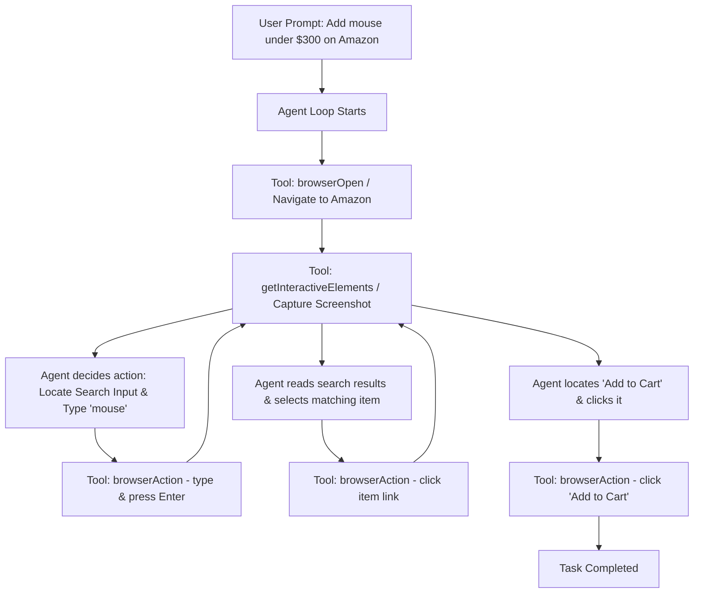

# Interactive Browser Automation Guide

This guide outlines how to extend Athena with **interactive web-agent capabilities**, allowing it to execute tasks like:
> *"Go to Amazon, search for a mouse under $300, and add it to the cart."*

Since you already have **Playwright** installed in your `package.json`, you have all the necessary libraries. Below is the architecture, implementation, and agent prompts needed to enable this.

---

## 1. Conceptual Architecture

To build a reliable web agent, you need an **Interactive Browser Loop**. Rather than writing a hardcoded script for Amazon, the agent must be able to view the page, decide the next action dynamically, and execute it.



---

## 2. Interactive Tool Design

To support this, we need to create interactive tools instead of just a static fetcher like [browser.ts](file:///c:/Users/raghu/Documents/Athena/src/tools/browser.ts). We need three key components:
1. **Persistent Browser Session Support**: To stay logged in or persist carts, we should run browser sessions using a user-data directory.
2. **Simplified Interactive Element Selector**: A utility to extract interactive elements (inputs, buttons, links) and tag them with custom IDs (e.g., `athena-id="1"`) so the LLM doesn't get overwhelmed by massive HTML source code.
3. **Execution Tool**: A tool to click, type, or scroll using those IDs.

### Implementation: `src/tools/interactiveBrowser.ts`
Here is a complete schema and code draft for an interactive browser toolset that you can add to Athena:

```typescript
import { Tool } from '../core/types.js';
import { chromium, BrowserContext, Page, ElementHandle } from 'playwright';
import * as path from 'path';

// Global session state to persist the browser session across tool calls
let activeBrowser: { context: BrowserContext; page: Page } | null = null;

// Initialize or reuse browser context
async function getBrowserSession() {
  if (activeBrowser) {
    return activeBrowser;
  }

  // Use a persistent context to preserve cookies/login/cart info
  const userDataDir = path.resolve('./.browser-session-data');
  const context = await chromium.launchPersistentContext(userDataDir, {
    headless: false, // Keep it visible for debug/manual checks
    viewport: { width: 1280, height: 800 },
    args: ['--no-sandbox', '--disable-setuid-sandbox']
  });

  const page = context.pages()[0] || (await context.newPage());
  
  // Set extra header values to mimic a normal browser
  await page.setExtraHTTPHeaders({
    'Accept-Language': 'en-US,en;q=0.9',
  });

  activeBrowser = { context, page };
  return activeBrowser;
}

/**
 * Tool: Navigate Browser
 */
export const browserNavigateTool: Tool = {
  definition: {
    name: 'browserNavigate',
    description: 'Navigate the active browser to a URL and return summary of interactive elements.',
    parameters: {
      type: 'OBJECT',
      properties: {
        url: { type: 'STRING', description: 'The URL to go to, e.g. "https://www.amazon.com"' }
      },
      required: ['url']
    }
  },
  requiresConfirmation: false,
  execute: async (args: { url: string }) => {
    try {
      const { page } = await getBrowserSession();
      await page.goto(args.url, { waitUntil: 'networkidle', timeout: 30000 });
      return await getPageElementsSummary(page);
    } catch (err: any) {
      return { success: false, error: `Failed to navigate: ${err.message}` };
    }
  }
};

/**
 * Tool: Interactive Action (Click, Type, Press Enter)
 */
export const browserActionTool: Tool = {
  definition: {
    name: 'browserAction',
    description: 'Perform an action on a page element.',
    parameters: {
      type: 'OBJECT',
      properties: {
        action: { 
          type: 'STRING', 
          enum: ['click', 'type', 'pressKey'], 
          description: 'The type of browser interaction.' 
        },
        selector: { 
          type: 'STRING', 
          description: 'A CSS selector, text matcher, or "athena-id" selector.' 
        },
        value: { 
          type: 'STRING', 
          description: 'Text to type (only if action is "type") or key name to press (e.g. "Enter").' 
        }
      },
      required: ['action', 'selector']
    }
  },
  requiresConfirmation: true, // Recommended: Prompt user before automated buying actions
  execute: async (args: { action: 'click' | 'type' | 'pressKey'; selector: string; value?: string }) => {
    try {
      const { page } = await getBrowserSession();
      
      // Handle custom ID selectors or standard selectors
      const selector = args.selector.startsWith('id=') 
        ? `[data-athena-id="${args.selector.split('=')[1]}"]` 
        : args.selector;

      const element = await page.waitForSelector(selector, { timeout: 10000 });
      if (!element) {
        return { success: false, error: `Element not found: ${args.selector}` };
      }

      if (args.action === 'click') {
        await element.click();
        await page.waitForTimeout(2000); // Give pages some time to transition
      } else if (args.action === 'type') {
        await element.fill(''); // Clear previous text
        await element.type(args.value || '');
      } else if (args.action === 'pressKey') {
        await page.keyboard.press(args.value || 'Enter');
        await page.waitForTimeout(2000);
      }

      return await getPageElementsSummary(page);
    } catch (err: any) {
      return { success: false, error: `Action failed: ${err.message}` };
    }
  }
};

/**
 * Helper: Extract interactive elements to present a lightweight representation to LLM
 */
async function getPageElementsSummary(page: Page) {
  // Inject tags on interactive nodes for easy identification
  await page.evaluate(() => {
    let idCounter = 1;
    const clickables = document.querySelectorAll('button, input, select, textarea, a, [role="button"]');
    clickables.forEach((el) => {
      // Clean previous tags
      el.removeAttribute('data-athena-id');
      
      // Check visibility & flag it
      const rect = el.getBoundingClientRect();
      if (rect.width > 0 && rect.height > 0 && window.getComputedStyle(el).display !== 'none') {
        el.setAttribute('data-athena-id', String(idCounter++));
      }
    });
  });

  // Extract clean data structure
  const elements = await page.evaluate(() => {
    const data: any[] = [];
    const elementsWithId = document.querySelectorAll('[data-athena-id]');
    elementsWithId.forEach((el) => {
      const id = el.getAttribute('data-athena-id');
      const tagName = el.tagName.toLowerCase();
      const text = el.textContent?.replace(/\s+/g, ' ').trim().slice(0, 100) || '';
      const type = (el as any).type || '';
      const placeholder = (el as any).placeholder || '';
      const ariaLabel = el.getAttribute('aria-label') || '';

      data.push({
        athenaId: id,
        tag: tagName,
        type: type || undefined,
        text: text || undefined,
        placeholder: placeholder || undefined,
        ariaLabel: ariaLabel || undefined,
      });
    });
    return data;
  });

  const title = await page.title();
  
  return {
    success: true,
    title,
    currentUrl: page.url(),
    interactiveElements: elements.slice(0, 150) // Cap to avoid context overflow
  };
}
```

---

## 3. Bot-Detection & Amazon Challenges

Sites like Amazon employ aggressive **Anti-Bot Checkers (CAPTCHAs)**. Standard Playwright instances will trigger "Robot Checks" immediately when trying to automate shopping loops. 

### Strategies to Bypass Anti-Bot Systems:
1. **Use Stealth Plugins (`playwright-extra`)**:
   Install `playwright-extra` and `user-agents-extra` to randomize browser fingerprints and evade detection:
   ```bash
   npm install playwright-extra puppeteer-extra-plugin-stealth
   ```
2. **Reuse a Real Chrome Profile (Persistent Context)**:
   Avoid clean incognito profiles. Log in manually once using a persistent profile directory, and let the agent reuse those cookies and user headers.
3. **Add Human-Like Delays**:
   Add jitter delays (e.g., random delay between typing keys, moving the mouse smoothly before clicking).

---

## 4. Prompting the Agent for Browser Tasks

When registering the tools above inside [src/tools/index.ts](file:///c:/Users/raghu/Documents/Athena/src/tools/index.ts), you must also update the agent's instructions (in [SOUL.md](file:///c:/Users/raghu/Documents/Athena/SOUL.md) or [DEFAULT_AGENT_PROMPT](file:///c:/Users/raghu/Documents/Athena/src/prompts/index.ts)) to explain how it should use the browser:

```markdown
### Browser Agent Guidelines:
- To browse or navigate: Use `browserNavigate`.
- To type or click: Look closely at the `interactiveElements` returned in the last tool execution. Use the `athenaId` formatted as `"id=12"` as the selector.
- Double-check elements before buying: Verify the item matches the criteria (e.g., price < $300) before clicking the product link or adding it to cart.
- Be resilient: If Amazon redirects you to a verification page or CAPTCHA, report it to the user so they can complete it manually in the opened browser window.
```

---

## 5. Walkthrough of the Interaction Flow
Here is a simulation of the agent loop resolving the user's task:

| Step | Agent Thought | Tool Called | Tool Response Snippet |
| :--- | :--- | :--- | :--- |
| **1** | I need to go to Amazon. | `browserNavigate({ url: "https://www.amazon.com" })` | `interactiveElements: [ { athenaId: "14", tag: "input", placeholder: "Search Amazon" }, ... ]` |
| **2** | I see the search input has `athenaId: 14`. I'll type "mouse" and submit. | `browserAction({ action: "type", selector: "id=14", value: "mouse" })` | `(same page with input filled)` |
| **3** | I need to submit the search. I will hit Enter. | `browserAction({ action: "pressKey", selector: "id=14", value: "Enter" })` | `interactiveElements: [ { athenaId: "45", text: "$45.99 Logitech G502 Mouse" }, ... ]` |
| **4** | I see a mouse under $300 (Logitech G502 for $45.99) at element `athenaId: 45`. I'll click it. | `browserAction({ action: "click", selector: "id=45" })` | `(product details page elements)` |
| **5** | I am on the product page. I need to click the "Add to Cart" button (e.g., `athenaId: 82`). | `browserAction({ action: "click", selector: "id=82" })` | `interactiveElements: [ { text: "Added to Cart" } ]` |
| **6** | The item is added. I will report success to the user. | *End Loop / Respond* | *"I've searched for a mouse under $300 and successfully added the Logitech G502 ($45.99) to your cart!"* |
