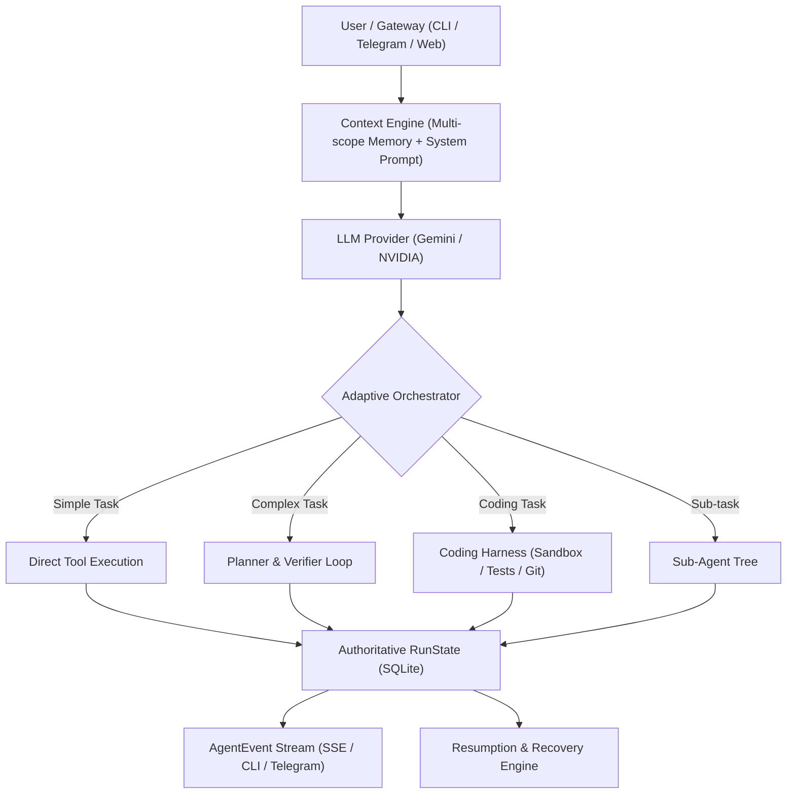

# ATHENA — MASTER PRODUCTION ROADMAP & PROGRESS TRACKER

> **North Star**: Adaptive agent runtime: keep a normal, lightweight LLM/tool loop for simple queries, and activate planning, verification, repair, and the Coding Harness only when task complexity or risk justifies the extra work. Reliability, recoverability, safety, and long-running autonomy over raw LLM turn count.

---

## 📊 Master Phase Progress Dashboard

| Phase | Subsystem | Ownership | Progress | Test Suite | Status |
| :--- | :--- | :--- | :---: | :--- | :--- |
| **Phase 1** | **Agent Runtime** | Athena Core | **100%** | `npm run test:runtime` | ✅ **Completed & Verified** |
| **Phase 2** | **Context + Memory** | Athena Core | **100%** | `npm run test:context_memory` | ✅ **Completed & Verified** |
| **Phase 3** | **Tool Runtime** | Athena Core | **100%** | `npm run test:tools` | ✅ **Completed & Verified** |
| **Phase 4** | **Adaptive Orchestration** | Athena Core | **100%** | `npm run test:orchestration` | ✅ **Completed & Verified** |
| **Phase 5** | **Coding Harness Integration** | Harness Bridge | **100%** | `npm run test:harness` | ✅ **Completed & Verified** |
| **Phase 6** | **Background + Event Runtime** | Athena Core | **100%** | `npm run test:background` | ✅ **Completed & Verified** |
| **Phase 7** | **Reliability + Security** | Athena Core | **100%** | `npm run test:security` | ✅ **Completed & Verified** |
| **Phase 8** | **Observability + Evaluation** | Athena Core | **100%** | `npm run test:observability` | ✅ **Completed & Verified** |
| **Phase 9** | **Platform / Production** | Athena Core | **0%** | `npm run test:production` | ⏳ Queued (superseded by V2 plan) |
| **V2 P1** | **Agent Foundation (Athena V2)** | Athena V2 | **100%** | `npm run test:v2p1` | ✅ **Completed & Verified** |
| **V2 P2** | **Persistent Autonomy (Athena V2)** | Athena V2 | **100%** | `npm run test:v2p2` | ✅ **Completed & Verified** |
| **V2 P3** | **Memory and Context (Athena V2)** | Athena V2 | **100%** | `npm run test:v2p3` | ✅ **Completed & Verified** |
| **V2 P4A** | **Action System: Registry, Discovery, Sandbox, FS, Terminal** | Athena V2 | **100%** | `npm run test:v2p4a` | ✅ **Completed & Verified** |
| **V2 P4B** | **Web Research, RAG, Documents (Athena V2)** | Athena V2 | **100%** | `npm run test:v2p4b` | ✅ **Completed & Verified** |
| **V2 P4C** | **Browser Environment (Athena V2)** | Athena V2 | **100%** | `npm run test:v2p4c` | ✅ **Completed & Verified** |
| **V2 P4D** | **Computer Use & Application Control (Athena V2)** | Athena V2 | **100%** | `npm run test:v2p4d` | ✅ **Completed & Verified** |
| **V2 P5** | **Learning: Skills, Routines, Workflows (Athena V2)** | Athena V2 | **100%** | `npm run test:v2p5` | ✅ **Completed & Verified** |
| **V2 P6** | **Multi-Agent: Profiles, Delegation, A2A (Athena V2)** | Athena V2 | **100%** | `npm run test:v2p6` | ✅ **Completed & Verified** |
| **V2 P8** | **Communication: Channels, Gateway, Calendar (Athena V2)** | Athena V2 | **100%** | `npm run test:v2p8` | ✅ **Completed & Verified** |
| **V2 P9+** | **Multimodal, Intelligence, Reliability, P9–P13 (Athena V2)** | Athena V2 | **0%** | see `docs/architecture/athena_v2_build_plan.md` | ⏳ Awaiting approval |

---

## 🏗️ Architecture Blueprint

---

## Phase 1: AGENT RUNTIME (Athena Core) — [100% COMPLETE]

- [x] **RunState Model**: One authoritative state model for every run ([`src/core/runState.ts`](file:///c:/Users/raghu/Documents/Athena/src/core/runState.ts)).
- [x] **Explicit Lifecycle**: `queued` ➔ `running` ➔ `waiting` ➔ `verifying` ➔ `completed` / `failed` / `cancelled`.
- [x] **Run Hierarchy**: Explicit `runId`, `parentRunId`, and `rootRunId` across sub-agent trees ([`src/tools/delegateTask.ts`](file:///c:/Users/raghu/Documents/Athena/src/tools/delegateTask.ts)).
- [x] **Typed AgentEvent Stream**: Real-time event emission for `status_change`, `turn_start`, `thought`, `tool_call`, `tool_result`, `subagent_spawn`, `subagent_finish`, `budget_warning`, `error`, `completed` ([`src/core/events.ts`](file:///c:/Users/raghu/Documents/Athena/src/core/events.ts)).
- [x] **Cooperative Cancellation**: Hierarchical cancellation tokens with `CancellationTokenSource`, propagating cleanly across sub-agents and abort signals ([`src/core/cancellation.ts`](file:///c:/Users/raghu/Documents/Athena/src/core/cancellation.ts)).
- [x] **Run Resumption**: Durable recovery of interrupted, paused, or failed runs from persisted state via `agent.resumeRun(runId)` ([`src/core/agent.ts`](file:///c:/Users/raghu/Documents/Athena/src/core/agent.ts)).
- [x] **Budget Engine**: Multi-resource constraints: `maxTimeMs`, `maxTokens`, `maxCostUsd`, `maxToolCalls`, `maxTurns`, and `childAgentBudget`.
- [x] **Structured Failures & Termination**: Typed taxonomy (`timeout`, `auth`, `rate-limit`, `invalid-input`, `policy`, `tool`, `provider`, `budget`, `bug`) and termination reasons.
- [x] **Idempotency Keys**: Tagging and replay caching for retryable side-effect tool calls to prevent accidental duplication.
- [x] **SQLite Persistence Layer**: Transactional state and event updates in SQLite tables `runs` and `run_events` ([`src/core/memory.ts`](file:///c:/Users/raghu/Documents/Athena/src/core/memory.ts)).
- [x] **User CLI Controls**: Interactive commands `/runs [all|sessionId]`, `/resume <runId>`, and graceful `Ctrl+C` cancellation ([`src/index.ts`](file:///c:/Users/raghu/Documents/Athena/src/index.ts)).

**Verification**:
* Test file: [`src/tests/test_phase1_runtime.ts`](file:///c:/Users/raghu/Documents/Athena/src/tests/test_phase1_runtime.ts)
* Command: `npm run test:runtime` (6/6 passing)
* Git commit: `a4e4ead` (Pushed to main)

---

## Phase 2: CONTEXT + MEMORY (Athena Core) — [100% COMPLETE]

- [x] **Context Engine**: Unify System Prompt, Task context, Workspace state, Working conversation, and Retrieved memory into a single budgeted prompt pipeline ([`src/core/contextEngine.ts`](file:///c:/Users/raghu/Documents/Athena/src/core/contextEngine.ts)).
- [x] **Multi-Scope Memory**:
  - `global`: Universal user preferences across all projects.
  - `user`: User-specific metadata, credentials, and constraints.
  - `workspace`: Working directory facts, repo layout, tech stack.
  - `project`: Project goals, roadmap, established coding conventions.
  - `session`: Current conversation thread history.
  - `task`: Ephemeral context dedicated to an active sub-task.
- [x] **Memory Provenance**: Track source (user message / tool execution / subagent finding), exact timestamp, origin `runId`, and verification evidence ([`src/core/memoryTypes.ts`](file:///c:/Users/raghu/Documents/Athena/src/core/memoryTypes.ts)).
- [x] **Confidence Scoring**: Calibrated confidence scores (0.0 to 1.0) and reinforcement on repeated confirmation (`reinforceMemory`).
- [x] **Memory Lifecycle**: States: `active` ➔ `confirmed` ➔ `contradicted` ➔ `superseded` ➔ `deleted`.
- [x] **Contradiction Resolution**: Cleanly link conflicting and updated facts via `supersededBy` and `supersedes` pointers (`resolveContradiction`).
- [x] **User Controls**: Added `/memory inspect [query]`, `/memory scopes`, `/memory forget <id>`, `/memory purge <scope>` CLI commands.
- [x] **Budget-Aware Context Truncation**: Truncate and prioritize semantic & episodic memories according to token budgets rather than naive count limits.
- [x] **Skill Registry Intelligence**: Track skill versioning, invocation success rates, and skill dependencies (`skill_registry` table in SQLite).

**Verification**:
* Test file: [`src/tests/test_phase2_context_memory.ts`](file:///c:/Users/raghu/Documents/Athena/src/tests/test_phase2_context_memory.ts)
* Command: `npm run test:context_memory` (7/7 passing)

---

## Phase 3: TOOL RUNTIME (Athena Core) — [100% COMPLETE]

- [x] **Unified `ToolResult<T>`**: Standardized return envelope: `{ success: boolean, data?: any, error?: { code, message }, retryable: boolean, metadata?: Record<string, any> }` ([`src/core/toolRuntime.ts`](file:///c:/Users/raghu/Documents/Athena/src/core/toolRuntime.ts)).
- [x] **Tool Manifests**: Schemas specifying version, required permissions (`fs:read`, `fs:write`, `cmd:exec`, `browser`, `memory`, `system`), risk level (`safe` | `confirm` | `destructive`), and timeout policy.
- [x] **Central Timeout Policy**: Configurable per-tool execution timeouts (e.g. 5s for math, 15s for search, 45s for browser, 60s for terminal) with cancellation token propagation.
- [x] **Circuit Breaker**: Resilient state transitions (`closed` ➔ `open` ➔ `half-open` ➔ `closed`) with failure thresholds, automatic cooldown, and canary tests to protect against failing MCP or remote tools.
- [x] **Tool Semantic Validation**: Pre-execution parameter validation against required JSON schema fields before dispatching.
- [x] **Output Offloading**: Auto-detect tool outputs exceeding token limits (16KB) and store full payloads as disk artifacts (`scratch/artifacts/`), returning structured previews.
- [x] **Relevant Tool Retrieval (Pruning)**: Dynamic intent-based tool filtering (`ToolSelector`) pruning 20+ tools down to context-specific subsets while keeping core utilities.
- [x] **Parallel Safety Flags**: Tag tools as `parallelSafe: true/false` for concurrency control.

**Verification**:
* Test file: [`src/tests/test_phase3_tools.ts`](file:///c:/Users/raghu/Documents/Athena/src/tests/test_phase3_tools.ts)
* Command: `npm run test:tools` (8/8 passing)

---

## Phase 4: ADAPTIVE ORCHESTRATION (Athena Differentiator) — [100% COMPLETE]

- [x] **Adaptive Execution Modes**:
  - Simple query ➔ Direct lightweight agent loop (zero planner or verifier token overhead).
  - Medium task ➔ Standard loop with checkpointing & context focus.
  - Complex task ➔ Explicit plan DAG decomposition (`PlanDAG`, `PlanStep`) with dependency resolution.
  - Risky action ➔ Escalation to verification gate and user confirmation.
- [x] **Task Complexity Classification**: Zero-overhead heuristic router (`TaskClassifier`) assigning complexity classes (`simple` | `medium` | `complex` | `high_risk`).
- [x] **Dynamic Escalation Engine**: Automatically escalates runtime execution mode (`simple` ➔ `medium` ➔ `complex`) upon detecting repeated tool failures or non-convergence (`DynamicEscalator`).
- [x] **Verification Gate**: Evaluates task completion against acceptance criteria, scoring responses and flagging defects (`VerificationGate`).
- [x] **Self-Repair Diagnostic Loop**: Automatically re-prompts the model with structured diagnostic feedback when verification checks flag deficiencies.
- [x] **Observable Decision Stream**: Emits `plan_created`, `plan_step_update`, `escalation`, `verification`, and `repair_attempt` typed events to `AgentEventEmitter`.

**Verification**:
* Test files: [`src/tests/test_phase4_adaptive_orchestration.ts`](file:///c:/Users/raghu/Documents/Athena/src/tests/test_phase4_adaptive_orchestration.ts) & [`src/tests/test_phase4_delegation.ts`](file:///c:/Users/raghu/Documents/Athena/src/tests/test_phase4_delegation.ts)
* Commands: `npm run test:orchestration` (6/6 passing) & `npm run test:delegation` (3/3 passing)

---

## Phase 5: CODING HARNESS INTEGRATION — [100% COMPLETE]

- [x] **Zero Duplicate Architecture**: Athena orchestrates coding execution via the external Coding Harness without duplicate sandboxes or rollback engines.
- [x] **Typed Protocol**:
  - `CodingTaskRequest`: `{ runId, task, cwd, traceId, maxIterations, timeoutSec, constraints, autoSnapshot }` ([`src/core/codingHarnessTypes.ts`](file:///c:/Users/raghu/Documents/Athena/src/core/codingHarnessTypes.ts)).
  - `CodingTaskResult`: `{ status, summary, filesChanged, testsPassed, diff, checkpointId, stdout, stderr, error, durationMs }`.
- [x] **Shared Run ID**: Athena `runId` passed to Harness via `--trace-id` for linked observability and telemetry.
- [x] **Live Progress Event Streaming**: Streams stderr and stdout thoughts and progress from the child process directly into Athena's `AgentEventEmitter` and CLI.
- [x] **Repository Intelligence**: `inspectRepo()` discovers workspace package manager (`npm`, `yarn`, `pnpm`, `bun`, `pip`, `cargo`), test scripts, and git branch status.
- [x] **Checkpoint & Rollback Coordination**: Coordinates pre-execution snapshots (`createSnapshot`) and rolls back automatically (`rollbackSnapshot`) if automated tests fail.
- [x] **Final Acceptance Gate**: `CodingAcceptanceGate.verify()` validates that status is successful, required files were modified, and tests passed.
- [x] **Hardened Tool Definition**: `delegateCodingTaskTool` wrapped with `ToolManifest` (`riskLevel: 'confirm'`, timeout: 300s, permissions: `cmd:exec`, `system`).

**Verification**:
* Test file: [`src/tests/test_phase5_coding_harness.ts`](file:///c:/Users/raghu/Documents/Athena/src/tests/test_phase5_coding_harness.ts)
* Command: `npm run test:harness` (5/5 passing)

---

## Phase 6: BACKGROUND + EVENT RUNTIME — [COMPLETED]

- [x] **Durable Task Scheduler**: Persistent cron and timer engine stored in SQLite (survives restarts) ([`src/core/scheduler.ts`](file:///c:/Users/raghu/Documents/Athena/src/core/scheduler.ts)).
- [x] **Timezone Support**: Schedule jobs with full IANA timezone awareness (`America/New_York`, `Asia/Kolkata`, `UTC`, etc.) using standard `Intl.DateTimeFormat`.
- [x] **Job Leases / Distributed Locks**: Atomic SQLite leases with auto-heartbeat renewal and expiration takeover ([`src/core/jobLease.ts`](file:///c:/Users/raghu/Documents/Athena/src/core/jobLease.ts)) preventing split-brain or duplicate execution across worker processes.
- [x] **Decoupled Event Bus**: Ingest events from webhooks, file watchers, system timers, and scheduler triggers with wildcard subscription patterns (`*`, `timer:*`, `webhook:*`) ([`src/core/eventBus.ts`](file:///c:/Users/raghu/Documents/Athena/src/core/eventBus.ts)).
- [x] **Idempotent Event Handlers**: Deduplicates incoming webhooks and triggers via idempotency keys and sliding time windows (`dedupWindowMs`), with audit trail in SQLite `event_log`.
- [x] **Priority Queue & Worker Pool**: Run background tasks asynchronously with configurable concurrency limits (`ATHENA_WORKER_CONCURRENCY`, default 2) and prioritized dispatch (`critical` > `high` > `normal` > `low`) ([`src/core/workerPool.ts`](file:///c:/Users/raghu/Documents/Athena/src/core/workerPool.ts)).
- [x] **Tool Updates**: `cronjob` tool updated with optional `timezone` and `priority` parameters ([`src/tools/cronjob.ts`](file:///c:/Users/raghu/Documents/Athena/src/tools/cronjob.ts)).

**Verification**:
* Test file: [`src/tests/test_phase6_background_runtime.ts`](file:///c:/Users/raghu/Documents/Athena/src/tests/test_phase6_background_runtime.ts)
* Command: `npm run test:background` (5/5 passing)

---

## Phase 7: RELIABILITY + SECURITY — [100% COMPLETE]

- [x] **Central Policy Engine**: Rule-based gatekeeper restricting sensitive file paths (`.env`, `id_rsa`, `.ssh/`, `credentials.json`, `client_secret*.json`), directory traversal outside workspace, and destructive commands (`rm -rf /`, `del /s /q C:\`, fork bombs, drive formatting) ([`src/core/policyEngine.ts`](file:///c:/Users/raghu/Documents/Athena/src/core/policyEngine.ts)).
- [x] **Prompt-Injection Defense**: Dual-boundary trust model wrapping untrusted web pages, emails, and external files in `<untrusted_content>` tags, disarming instruction overrides, jailbreaks, and delimiter evasions ([`src/core/promptDefense.ts`](file:///c:/Users/raghu/Documents/Athena/src/core/promptDefense.ts)).
- [x] **Credential Isolation**: Deep recursive secret redactor masking Gemini, OpenAI, Nvidia, Telegram, AWS, GitHub, and Bearer tokens from tool results, logs, and histories ([`src/core/credentialManager.ts`](file:///c:/Users/raghu/Documents/Athena/src/core/credentialManager.ts)).
- [x] **Provider Fallback**: Automatic failover (e.g. Gemini ➔ NVIDIA GLM / OpenAI) on HTTP 429 rate limits, 500/503 outages, or connection resets with primary cooldown circuit breaker ([`src/core/llmProvider.ts`](file:///c:/Users/raghu/Documents/Athena/src/core/llmProvider.ts)).
- [x] **Failure Taxonomy & Recovery**: Structured categorization of `rate_limit`, `provider_outage`, `network_reset`, `timeout`, `auth`, `policy_violation` with tailored exponential backoff, failover, or abort recovery strategies ([`src/core/failureRecovery.ts`](file:///c:/Users/raghu/Documents/Athena/src/core/failureRecovery.ts)).
- [x] **Tool Runtime & Chaos Recovery**: Integrated policy checks before tool execution, automatic untrusted content wrapping, secret scrubbing on outputs, and graceful timeout / circuit breaker recovery in `ToolExecutor` ([`src/core/toolRuntime.ts`](file:///c:/Users/raghu/Documents/Athena/src/core/toolRuntime.ts)).

**Verification**:
* Test file: [`src/tests/test_phase7_reliability_security.ts`](file:///c:/Users/raghu/Documents/Athena/src/tests/test_phase7_reliability_security.ts)
* Command: `npm run test:security` (6/6 passing)

---

## Phase 8: OBSERVABILITY + EVALUATION — [100% COMPLETE]

- [x] **OpenTelemetry & Langfuse Alignment**: Unify trace IDs, span hierarchies, and metadata across Athena Core, Sub-agents, and Coding Harness.
- [x] **Telemetry Metrics**: Latency histograms, input/output token counts, cost estimations, and failure clustering.
- [x] **Run Trajectory Debugger**: Visual timeline replay of model reasoning, tool invocations, and state transitions.
- [x] **Replay Benchmarks**: Re-run past agent sessions with recorded tool outputs to test prompt modifications without burning API credits.
- [x] **Adversarial Evaluation Suite**: Automated benchmarks testing resistance to memory poisoning, prompt injection, and hallucinated tool calls.

**Verification**:
* Test file: [`src/tests/test_phase8_observability_eval.ts`](file:///c:/Users/raghu/Documents/Athena/src/tests/test_phase8_observability_eval.ts)
* Commands: `npm run test:phase8` (6/6 passing) & `npm run test:observability` (passing)

---

## Phase 9: PLATFORM / PRODUCTION — [QUEUED]

- [ ] **Unified Runtime API**: REST / WebSocket / SSE interface exposing `createRun`, `getRun`, `cancelRun`, `resumeRun`, and `streamEvents`.
- [ ] **Multi-Interface Consistency**: CLI, Telegram Gateway, and future Web Dashboards share the exact same runtime API.
- [ ] **Control Plane UI**: Modern web dashboard for inspecting active runs, browsing scoped memory, managing scheduled jobs, and viewing artifacts.
- [x] **Database Migrations**: Automated migration runner for SQLite/PostgreSQL schemas *(SQLite runner shipped early in V2 P1; PostgreSQL parity lands in V2 P12)*.
- [ ] **Production Profile**: PostgreSQL + pgvector support for high-throughput enterprise deployments.

---

## ATHENA V2 (branch `athena-v2`) — build in progress

> Plan: [`docs/architecture/athena_v2_build_plan.md`](file:///c:/Users/raghu/Documents/Athena/docs/architecture/athena_v2_build_plan.md). One phase at a time; each phase is committed only after its exit criteria pass.

### V2 P1: AGENT FOUNDATION — [100% COMPLETE]

- [x] **Versioned migration layer**: `PRAGMA user_version` + `schema_migrations` audit table; transactional, rollback-safe, idempotent `v1_baseline` (M001) and `v2_p1_agent_foundation` (M002) ([`src/core/database.ts`](file:///c:/Users/raghu/Documents/Athena/src/core/database.ts), [`src/core/migrations/index.ts`](file:///c:/Users/raghu/Documents/Athena/src/core/migrations/index.ts)).
- [x] **Versioned `AgentProfile`**: seeded from `SOUL.md`, rendered back to the soul; append-only version history (`agent_profiles` + `agent_profile_versions`) ([`src/core/identity.ts`](file:///c:/Users/raghu/Documents/Athena/src/core/identity.ts), [`src/core/identityTypes.ts`](file:///c:/Users/raghu/Documents/Athena/src/core/identityTypes.ts)).
- [x] **`User` model**: preferences (style, timezone, working hours, notifications, approvals), permissions, relationships, routines — separate from generic memory.
- [x] **Workspace / Project entities**: real tables with filesystem roots; ContextEngine and PolicyEngine enforce boundaries ([`src/core/stores/sqlite/sqliteWorkspaceStore.ts`](file:///c:/Users/raghu/Documents/Athena/src/core/stores/sqlite/sqliteWorkspaceStore.ts)).
- [x] **Candidate memory lifecycle**: model-inferred `user`-scope facts enter as `candidate` and only become permanent via explicit `validateMemory()` ([`src/core/memory.ts`](file:///c:/Users/raghu/Documents/Athena/src/core/memory.ts)).
- [x] **Workspace binding on `scoped_memory`**: nullable `workspace_id` / `project_id` / `agent_id`; NULL = cross-workspace (V1 visibility preserved); search filters bind-aware.
- [x] **Permission model**: composed agent + user + tool rules as the primary layer in PolicyEngine; V1 hardcoded rules remain the secondary layer ([`src/core/policyEngine.ts`](file:///c:/Users/raghu/Documents/Athena/src/core/policyEngine.ts), [`src/core/toolRuntime.ts`](file:///c:/Users/raghu/Documents/Athena/src/core/toolRuntime.ts)).
- [x] **Store interfaces**: `AgentStore`, `UserStore`, `WorkspaceStore`, `ProjectStore`, `RunStore`, `EventStore` with SQLite implementations behind them; `EpisodicMemory` delegates (zero caller changes) ([`src/core/stores/types.ts`](file:///c:/Users/raghu/Documents/Athena/src/core/stores/types.ts)).
- [x] **ADRs**: [`docs/decisions/`](file:///c:/Users/raghu/Documents/Athena/docs/decisions) — 0001 store interfaces, 0002 migrations, 0003 profile versioning, 0004 permission model.

**Verification**:
* Test file: [`src/tests/test_v2_p1_agent_foundation.ts`](file:///c:/Users/raghu/Documents/Athena/src/tests/test_v2_p1_agent_foundation.ts)
* Command: `npm run test:v2p1` (9/9 passing)
* Full V1 suite re-run: no regressions (all suites pass; `test:evolution` fails identically on the `main` baseline — pre-existing, 0/3 there)

### V2 P2: PERSISTENT AUTONOMY — [100% COMPLETE]

- [x] `Goal` / `Task` entities with lifecycle, dependencies, attempts, structured planner output into SQLite.
- [x] 12-state run lifecycle; durable waiting (`run_waits` + matcher on EventBus, no `setTimeout`).
- [x] Crash-safe resume (`CrashResumeSweeper`), lease takeover, idempotency (10/10 chaos trials, zero duplicate side effects).
- [x] Goal budgets enforced strictly above run budgets; background runs restricted to safe tools until P4A.
- [x] Hierarchical telemetry: Goal span → Task span → Run span. ADR-0005.

**Verification**: `npm run test:v2p2` (11/11 passing, all 4 exit criteria passed)

### V2 P3: MEMORY AND CONTEXT — [100% COMPLETE]

- [x] Memory model per spec (`agent`/`goal` scopes, types, `archived`/`quarantined` lifecycles); Section 65 secure write pipeline (injection quarantine, credential masking).
- [x] Universal session search (FTS5 over messages, tool calls/outputs, plans, thoughts, errors, runs) with filters.
- [x] Bounded context references (`@file`, `@folder`, `@repo`, `@url`, `@run`, `@goal`, `@task`, `@memory`, `@artifact`, `@project`).
- [x] Cache-friendly layered ContextEngine (stable prefix); `TokenAccountant` (input/output/cached tokens, latency, cost).
- [x] Store interfaces `MemoryStore` + `SessionSearchStore` (SQLite impls). ADR-0006.

**Verification**: `npm run test:v2p3` (9/9 passing, all 3 exit criteria passed)

### V2 P4A: ACTION SYSTEM (REGISTRY, DISCOVERY, SANDBOX, FS, TERMINAL) — [100% COMPLETE]

- [x] Full `ToolDefinition` + `SearchableToolRegistry` + 5-stage discovery (100+ tools, prompt bounded ≤ 2000 tokens).
- [x] `ExecutionBackend` (`LocalExecutionBackend`, `SandboxedExecutionBackend`), scoped `FilesystemEngine`, `ProcessManager`.
- [x] `ObfuscationDetector` + PolicyEngine modernization (canonical realpath, obfuscation deny, background sandbox guard).
- [x] ADR-0007.

**Verification**: `npm run test:v2p4a` (6/6 passing, all 3 exit criteria passed)

### V2 P4B: WEB RESEARCH, RAG, DOCUMENT INTELLIGENCE — [100% COMPLETE]

- [x] **Migration 5** (`v2_p4b_research_rag_documents`): `vector_embeddings`, `research_documents`.
- [x] **`VectorStore` interface + SQLite impl** (pgvector adapter deferred to P12 per ADR-0001); `ResearchDocumentStore`; `EmbeddingProvider` extracted from `EpisodicMemory` (behavior identical).
- [x] **Real local cross-encoder reranker** (`@huggingface/transformers`, `Xenova/ms-marco-MiniLM-L-6-v2`, in-process): measured gain over lexical TF baseline on a fixed dataset (gold passage rank 2 → 1); when the model can't load the capability is `unsupported` and the rerank stage is skipped with a reason — never faked.
- [x] **Capability registry (first in codebase)**: `real | experimental | unsupported` + reasons; OCR `experimental`, `rag.rerank` tracks true backend state.
- [x] **Document intelligence**: PDF (pdf-parse v2), DOCX (mammoth), XLSX (sheetjs), CSV (papaparse), HTML (script/style stripped), Markdown/text; images via tesseract.js OCR (experimental).
- [x] **Structure-aware chunker** (heading → paragraph → sentence + overlap + coverage); large documents always go through retrieval, never wholesale into context.
- [x] **RAG pipeline**: ingest (SHA-256 dedupe, changed-source replacement) → embed → vector retrieve → cross-encoder rerank → cited chunks.
- [x] **Research pipeline**: search → retrieve → extract → reason → cross-check → synthesize → cite; findings labeled `source` / `inference` / `uncertainty` with 1-based citations; all retrieved content sanitized via PromptDefense (injection neutralized + reported).
- [x] **Tools**: `researchWeb`, `ingestDocument`, `searchDocuments`, `readDocument` (budget-enforcing), registered through the P4A registry. ADR-0008.

**Verification**:
* Test file: [`src/tests/test_v2_p4b_research_rag_docs.ts`](file:///c:/Users/raghu/Documents/Athena/src/tests/test_v2_p4b_research_rag_docs.ts)
* Command: `npm run test:v2p4b` (9/9 passing — all 3 exit criteria passed)
* Full V2 + V1 suite re-run: no regressions (`test:evolution` still the pre-existing failure; adversarial eval 10/12, improved from the recorded 8/12)

### V2 P4C: BROWSER AS FIRST-CLASS ENVIRONMENT — [100% COMPLETE]
- [x] Schema Migration 6 (`v2_p4c_browser_profiles`): `browser_profiles`.
- [x] `BrowserEngine` with Playwright persistent contexts, multi-tab management, `data-athena-id` tagging, ARIA snapshots, downloads, cookie management, and screenshots.
- [x] PromptDefense Untrusted Boundary on all page content.
- [x] Tools: `browserNavigate`, `browserAction`, `browserTabManage`, `browserSessionManage`, `browserExtract`, `browserScreenshot`. ADR-0009.
- [x] Verification: `npm run test:v2p4c` (9/9 passing).

### V2 P4D: COMPUTER USE AND APPLICATION CONTROL — [100% COMPLETE]
- [x] Real OS automation backends (Windows UI Automation, macOS Accessibility, Linux AT-SPI).
- [x] Screen inspection, desktop capture, application window enumeration, input action audit logging.
- [x] Whitelisted application title policy guard.
- [x] Tools: `computerInspect`, `computerInteract`, `computerManageWindow`. ADR-0010.
- [x] Verification: `npm run test:v2p4d` (8/8 passing).

### V2 P5: LEARNING (PROGRESSIVE DISCLOSURE, ROUTINES, WORKFLOWS) — [100% COMPLETE]
- [x] Schema Migration 7 (`v2_p5_learning`): `routines`, `learned_workflows`, `skill_records`.
- [x] `ProgressiveSkillManager`, `RoutineEngine`, `WorkflowLearner`.
- [x] Tools: `routineManage`, `workflowLearn`. ADR-0011.
- [x] Verification: `npm run test:v2p5` (9/9 passing).

### V2 P6: MULTI-AGENT SUBSYSTEM — [100% COMPLETE]
- [x] Schema Migration 8 (`v2_p6_multi_agent`): `agent_messages`, `agent_teams`.
- [x] 6 specialized profiles (`Researcher`, `Coder`, `Reviewer`, `Planner`, `Browser`, `Data`).
- [x] `DelegationContractEngine` with tool scoping guard, depth limit ≤3, concurrency cap ≤5.
- [x] Durable A2A Mailbox (9 message types) & crash-safe handoff pipeline surviving restarts.
- [x] Tools: `agentDelegate`, `agentMessageSend`, `agentMailboxCheck`. ADR-0012.
- [x] Verification: `npm run test:v2p6` (10/10 passing).

### V2 P7: PROACTIVE AGENT SUBSYSTEM — [100% COMPLETE]
- [x] Schema Migration 9 (`v2_p7_proactive_agent`): `durable_agent_events`, `webhook_endpoints`, `webhook_receipts`, `heartbeat_logs`.
- [x] Multi-stage event pipeline (Filter → Relevance → Wake → Reason → Action) with cost controls.
- [x] Cost-capped proactive heartbeat engine ($0 quiet ticks, spend limits).
- [x] Secure webhook ingestion (HMAC-SHA256, replay protection, privilege separation guard).
- [x] Stalled goal autonomous wake detection and event replay.
- [x] Tools: `proactiveHeartbeatConfig`, `webhookManage`, `eventReplay`. ADR-0013.
- [x] Verification: `npm run test:v2p7` (10/10 passing).

### V2 P8: COMMUNICATION SUBSYSTEM — [100% COMPLETE]
- [x] Schema Migration 10 (`v2_p8_communication`): `channels`, `conversations`, `participants`, `channel_messages`, `calendar_events`.
- [x] Normalized Channel Adapters (CLI, Telegram, Email, Discord, Slack, WhatsApp).
- [x] `ChannelGatewayManager` routing all channels into single persistent core with stranger privilege separation guard.
- [x] `CalendarEngine` with natural language deadlines ("tomorrow morning" -> epoch) and proactive reminder alerts.
- [x] Tools: `sendMessage`, `calendarManage`, `reminderSet`. ADR-0014.
- [x] Verification: `npm run test:v2p8` (11/11 passing).

### V2 P9: MULTIMODAL AND VOICE SUBSYSTEM — [100% COMPLETE]
- [x] Schema Migration 11 (`v2_p9_multimodal_voice`): `multimodal_artifacts` table storing image, audio, pdf, video metadata and transcripts.
- [x] `MultimodalStore` interface & `SqliteMultimodalStore` implementation behind `EpisodicMemory`.
- [x] Multimodal Providers: Gemini & Mock Vision (OCR, UI elements), Gemini & Mock STT, Synthesized & Cloud TTS (valid 16kHz PCM WAV with 44-byte RIFF header), Image Generation.
- [x] `MultiModalEngine` orchestrating vision analysis, audio transcription, speech synthesis, image generation, and artifact persistence.
- [x] Exit Criterion 1: Voice request creates goal through normal core path (`agent.createGoal()` and `agent.planGoal()`), persisting goals and planned tasks in SQLite with voice confirmation.
- [x] Exit Criterion 2: Screenshot → browser → verify E2E loop with closed-loop visual validation.
- [x] Tools: `imageInspect`, `imageGenerate`, `voiceTranscribe`, `voiceSpeak`, `voiceGoalCreate`.
- [x] Capability Registry honesty: `multimodal.vision`, `multimodal.stt`, `multimodal.tts`, `multimodal.image_generation`, `multimodal.voice_goal_routing`, `multimodal.screenshot_browser_loop` (real), `multimodal.realtime_voice_duplex` (experimental), `multimodal.video_streaming` (unsupported).
- [x] ADR: `docs/decisions/0015-multimodal-voice-vision-stt-tts-p9.md`.
- [x] Verification: `npm run test:v2p9` (11/11 passing).
