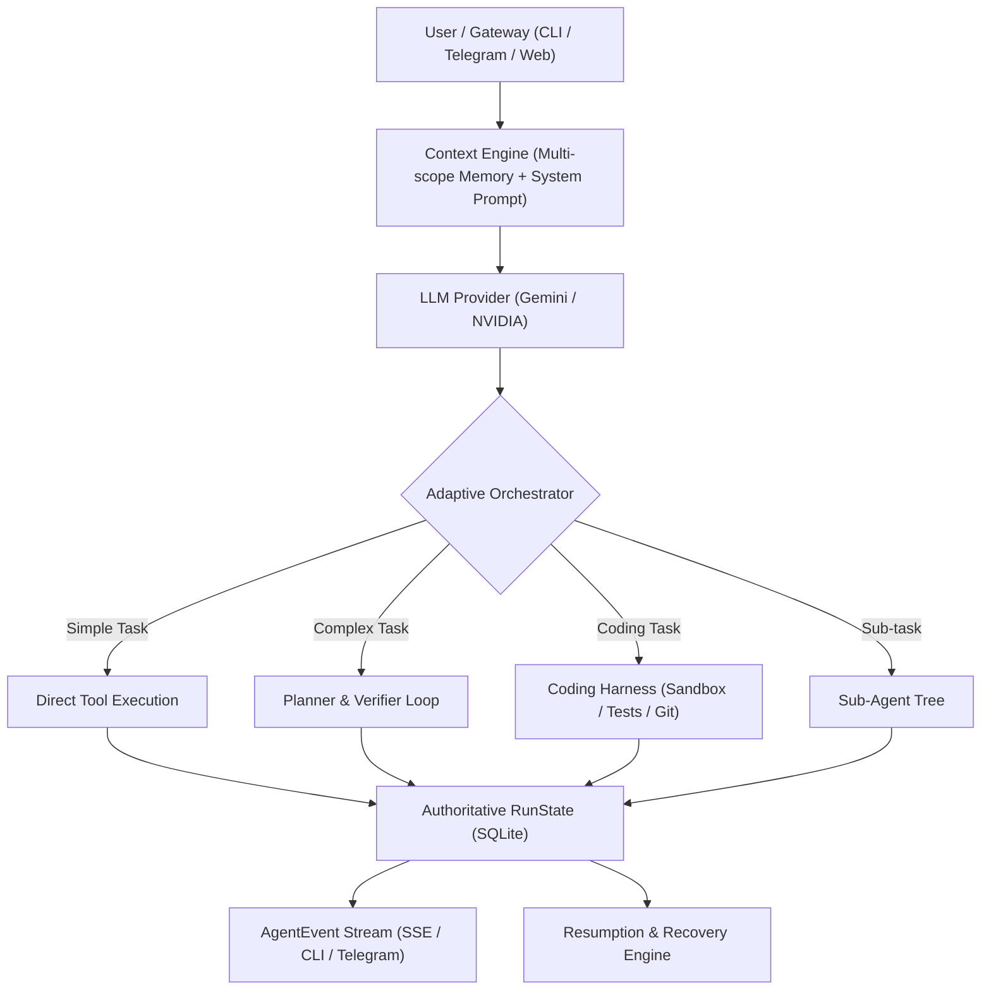

# ATHENA — MASTER PRODUCTION ROADMAP & PROGRESS TRACKER

> **North Star**: Adaptive agent runtime: keep a normal, lightweight LLM/tool loop for simple queries, and activate planning, verification, repair, and the Coding Harness only when task complexity or risk justifies the extra work. Reliability, recoverability, safety, and long-running autonomy over raw LLM turn count.

---

## 📊 Master Phase Progress Dashboard

| Phase | Subsystem | Ownership | Progress | Test Suite | Status |
| :--- | :--- | :--- | :---: | :--- | :--- |
| **Phase 1** | **Agent Runtime** | Athena Core | **100%** | `npm run test:runtime` | ✅ **Completed & Verified** |
| **Phase 2** | **Context + Memory** | Athena Core | **100%** | `npm run test:context_memory` | ✅ **Completed & Verified** |
| **Phase 3** | **Tool Runtime** | Athena Core | **0%** | `npm run test:tools` | 🟡 **Next Up** |
| **Phase 4** | **Adaptive Orchestration** | Athena Core | **0%** | `npm run test:delegation` | ⏳ Queued |
| **Phase 5** | **Coding Harness Integration** | Harness Bridge | **0%** | `npm run test:eval` | ⏳ Queued |
| **Phase 6** | **Background + Event Runtime** | Athena Core | **0%** | `npm run test:evolution` | ⏳ Queued |
| **Phase 7** | **Reliability + Security** | Athena Core | **0%** | `npm run test:security` | ⏳ Queued |
| **Phase 8** | **Observability + Evaluation** | Athena Core | **0%** | `npm run test:observability` | ⏳ Queued |
| **Phase 9** | **Platform / Production** | Athena Core | **0%** | `npm run test:production` | ⏳ Queued |

---

## 🏗️ Architecture Blueprint

---

## Phase 1: AGENT RUNTIME (Athena Core) — [100% COMPLETE]

- [x] **RunState Model**: One authoritative state model for every run ([`src/core/runState.ts`](file:///c:/Users/raghu/Documents/Athena/src/core/runState.ts)).
- [x] **Explicit Lifecycle**: `queued` ➔ `running` ➔ `waiting` ➔ `verifying` ➔ `completed` / `failed` / `cancelled`.
- [x] **Run Hierarchy**: Explicit `runId`, `parentRunId`, and `rootRunId` across sub-agent trees ([`src/tools/delegateTask.ts`](file:///c:/Users/raghu/Documents/Athena/src/tools/delegateTask.ts)).
- [x] **Typed AgentEvent Stream**: Real-time event emission for `status_change`, `turn_start`, `thought`, `tool_call`, `tool_result`, `subagent_spawn`, `subagent_finish`, `budget_warning`, `error`, `completed` ([`src/core/events.ts`](file:///c:/Users/raghu/Documents/Athena/src/core/events.ts)).
- [x] **Cooperative Cancellation**: Hierarchical cancellation tokens with `CancellationTokenSource`, propagating cleanly across sub-agents and abort signals ([`src/core/cancellation.ts`](file:///c:/Users/raghu/Documents/Athena/src/core/cancellation.ts)).
- [x] **Run Resumption**: Durable recovery of interrupted, paused, or failed runs from persisted state via `agent.resumeRun(runId)` ([`src/core/agent.ts`](file:///c:/Users/raghu/Documents/Athena/src/core/agent.ts)).
- [x] **Budget Engine**: Multi-resource constraints: `maxTimeMs`, `maxTokens`, `maxCostUsd`, `maxToolCalls`, `maxTurns`, and `childAgentBudget`.
- [x] **Structured Failures & Termination**: Typed taxonomy (`timeout`, `auth`, `rate-limit`, `invalid-input`, `policy`, `tool`, `provider`, `budget`, `bug`) and termination reasons.
- [x] **Idempotency Keys**: Tagging and replay caching for retryable side-effect tool calls to prevent accidental duplication.
- [x] **SQLite Persistence Layer**: Transactional state and event updates in SQLite tables `runs` and `run_events` ([`src/core/memory.ts`](file:///c:/Users/raghu/Documents/Athena/src/core/memory.ts)).
- [x] **User CLI Controls**: Interactive commands `/runs [all|sessionId]`, `/resume <runId>`, and graceful `Ctrl+C` cancellation ([`src/index.ts`](file:///c:/Users/raghu/Documents/Athena/src/index.ts)).

**Verification**:
* Test file: [`src/tests/test_phase1_runtime.ts`](file:///c:/Users/raghu/Documents/Athena/src/tests/test_phase1_runtime.ts)
* Command: `npm run test:runtime` (6/6 passing)
* Git commit: `a4e4ead` (Pushed to main)

---

## Phase 2: CONTEXT + MEMORY (Athena Core) — [100% COMPLETE]

- [x] **Context Engine**: Unify System Prompt, Task context, Workspace state, Working conversation, and Retrieved memory into a single budgeted prompt pipeline ([`src/core/contextEngine.ts`](file:///c:/Users/raghu/Documents/Athena/src/core/contextEngine.ts)).
- [x] **Multi-Scope Memory**:
  - `global`: Universal user preferences across all projects.
  - `user`: User-specific metadata, credentials, and constraints.
  - `workspace`: Working directory facts, repo layout, tech stack.
  - `project`: Project goals, roadmap, established coding conventions.
  - `session`: Current conversation thread history.
  - `task`: Ephemeral context dedicated to an active sub-task.
- [x] **Memory Provenance**: Track source (user message / tool execution / subagent finding), exact timestamp, origin `runId`, and verification evidence ([`src/core/memoryTypes.ts`](file:///c:/Users/raghu/Documents/Athena/src/core/memoryTypes.ts)).
- [x] **Confidence Scoring**: Calibrated confidence scores (0.0 to 1.0) and reinforcement on repeated confirmation (`reinforceMemory`).
- [x] **Memory Lifecycle**: States: `active` ➔ `confirmed` ➔ `contradicted` ➔ `superseded` ➔ `deleted`.
- [x] **Contradiction Resolution**: Cleanly link conflicting and updated facts via `supersededBy` and `supersedes` pointers (`resolveContradiction`).
- [x] **User Controls**: Added `/memory inspect [query]`, `/memory scopes`, `/memory forget <id>`, `/memory purge <scope>` CLI commands.
- [x] **Budget-Aware Context Truncation**: Truncate and prioritize semantic & episodic memories according to token budgets rather than naive count limits.
- [x] **Skill Registry Intelligence**: Track skill versioning, invocation success rates, and skill dependencies (`skill_registry` table in SQLite).

**Verification**:
* Test file: [`src/tests/test_phase2_context_memory.ts`](file:///c:/Users/raghu/Documents/Athena/src/tests/test_phase2_context_memory.ts)
* Command: `npm run test:context_memory` (7/7 passing)

---

## Phase 3: TOOL RUNTIME (Athena Core) — [QUEUED]

- [ ] **Unified `ToolResult`**: Standardized return envelope: `{ success: boolean, data?: any, error?: string, retryable: boolean, metadata?: Record<string, any> }`.
- [ ] **Tool Manifests**: Schemas specifying version, required permissions, risk level (`safe` | `confirm` | `destructive`), and resource cost.
- [ ] **Central Timeout Policy**: Configurable per-tool execution timeouts (e.g. 15s for search, 60s for browser, 10s for filesystem).
- [ ] **Idempotent Retry & Backoff**: Automatic exponential backoff only for retryable network/provider errors.
- [ ] **Circuit Breaker**: Auto-trip and temporary quarantine for unhealthy MCP servers or failing external tools.
- [ ] **Tool Semantic Validation**: Pre-execution parameter validation against JSON schema before dispatch.
- [ ] **Output Offloading**: Auto-truncate tool outputs exceeding token limits and store large payloads as disk artifacts (`scratch/artifacts/`).
- [ ] **Relevant Tool Retrieval**: Dynamic tool subset filtering based on task intent instead of dumping 40+ tool definitions into every prompt.
- [ ] **Parallel Safety Flags**: Tag tools as `sequential-only` vs `parallel-safe` for concurrency control.

---

## Phase 4: ADAPTIVE ORCHESTRATION (Athena Differentiator) — [QUEUED]

- [ ] **Adaptive Loop**:
  - Simple query ➔ Standard direct agent loop (zero planner or verifier token overhead).
  - Medium task ➔ Mid-flight checkpoints + focused context extraction.
  - Complex task ➔ Explicit plan creation (DAG of steps, dependencies, acceptance criteria).
  - Risky action ➔ Escalation to policy engine and user confirmation.
- [ ] **Dynamic Escalation**: Allow runtime escalation: direct loop ➔ planner ➔ specialized subagent ➔ verifier.
- [ ] **Verification Gate**: Optional verifier sub-agent invoked only for high-stakes assertions.
- [ ] **Repair Loop**: When verification fails, route structured diagnostics into a dedicated repair cycle instead of returning raw failure.
- [ ] **Observable Decision Graph**: Maintain and visualize orchestration decision trees.

---

## Phase 5: CODING HARNESS INTEGRATION — [QUEUED]

- [ ] **Zero Duplicate Architecture**: Do **NOT** build a secondary sandbox, rollback engine, or checkpoint system in Athena. Harness owns coding execution.
- [ ] **Typed Protocol**:
  - `CodingTaskRequest`: `{ runId, task, cwd, constraints, allowedCapabilities, budget }`
  - `CodingTaskResult`: `{ status, summary, filesChanged, tests, diff, checkpointId, verification, artifacts, errors }`
- [ ] **Shared Run ID**: Athena `runId` propagated directly through the Coding Harness and evaluation logs.
- [ ] **Harness Lifecycle Streaming**: Stream events (`inspecting`, `editing`, `testing`, `repairing`, `verifying`, `completed`) into Athena's `AgentEventStream`.
- [ ] **Repository Intelligence**: Query Harness for project tech stack, package manager, test scripts, and git status.
- [ ] **Checkpoint & Rollback Coordination**: Athena requests Harness checkpoints before risky refactors and issues rollbacks on test failure.
- [ ] **Final Acceptance Gate**: Git diff + automated tests + verification pass before marking task complete.

---

## Phase 6: BACKGROUND + EVENT RUNTIME — [QUEUED]

- [ ] **Durable Task Scheduler**: Persistent cron and timer engine stored in SQLite (survives restarts).
- [ ] **Timezone Support**: Schedule jobs with IANA timezone awareness (`America/New_York`, `Asia/Kolkata`, etc.).
- [ ] **Job Leases / Distributed Locks**: Prevent duplicate execution when multiple worker processes or gateway instances run.
- [ ] **Event Bus**: Ingest events from webhooks, GitHub notifications, local file watchers, and system timers.
- [ ] **Priority Queue & Worker Pool**: Run background tasks asynchronously with concurrency limits without blocking interactive chat.
- [ ] **Idempotent Event Handlers**: Deduplicate incoming webhooks and retry missed background triggers.

---

## Phase 7: RELIABILITY + SECURITY — [QUEUED]

- [ ] **Central Policy Engine**: Rule-based gatekeeper restricting sensitive file paths, destructive commands, and secret exfiltration.
- [ ] **Prompt-Injection Defense**: Dual-boundary trust model: external web pages, emails, and files are tagged as untrusted data, never as system instructions.
- [ ] **Credential Isolation**: Secrets stored in environment/vault; tools receive scoped temporary tokens without leaking raw keys to the model.
- [ ] **Provider Fallback**: Automatic failover (e.g. Gemini ➔ NVIDIA GLM / OpenAI) on HTTP 429 rate limits or provider outages.
- [ ] **Failure Taxonomy & Recovery**: Tailored strategies for `timeout`, `rate-limit`, `auth_error`, and `network_reset`.
- [ ] **Chaos Testing**: Automated tests simulating MCP server disconnects, tool timeouts, and process SIGKILL recovery.

---

## Phase 8: OBSERVABILITY + EVALUATION — [QUEUED]

- [ ] **OpenTelemetry & Langfuse Alignment**: Unify trace IDs, span hierarchies, and metadata across Athena Core, Sub-agents, and Coding Harness.
- [ ] **Telemetry Metrics**: Latency histograms, input/output token counts, cost estimations, and failure clustering.
- [ ] **Run Trajectory Debugger**: Visual timeline replay of model reasoning, tool invocations, and state transitions.
- [ ] **Replay Benchmarks**: Re-run past agent sessions with recorded tool outputs to test prompt modifications without burning API credits.
- [ ] **Adversarial Evaluation Suite**: Automated benchmarks testing resistance to memory poisoning, prompt injection, and hallucinated tool calls.

---

## Phase 9: PLATFORM / PRODUCTION — [QUEUED]

- [ ] **Unified Runtime API**: REST / WebSocket / SSE interface exposing `createRun`, `getRun`, `cancelRun`, `resumeRun`, and `streamEvents`.
- [ ] **Multi-Interface Consistency**: CLI, Telegram Gateway, and future Web Dashboards share the exact same runtime API.
- [ ] **Control Plane UI**: Modern web dashboard for inspecting active runs, browsing scoped memory, managing scheduled jobs, and viewing artifacts.
- [ ] **Database Migrations**: Automated migration runner for SQLite/PostgreSQL schemas.
- [ ] **Production Profile**: PostgreSQL + pgvector support for high-throughput enterprise deployments.
